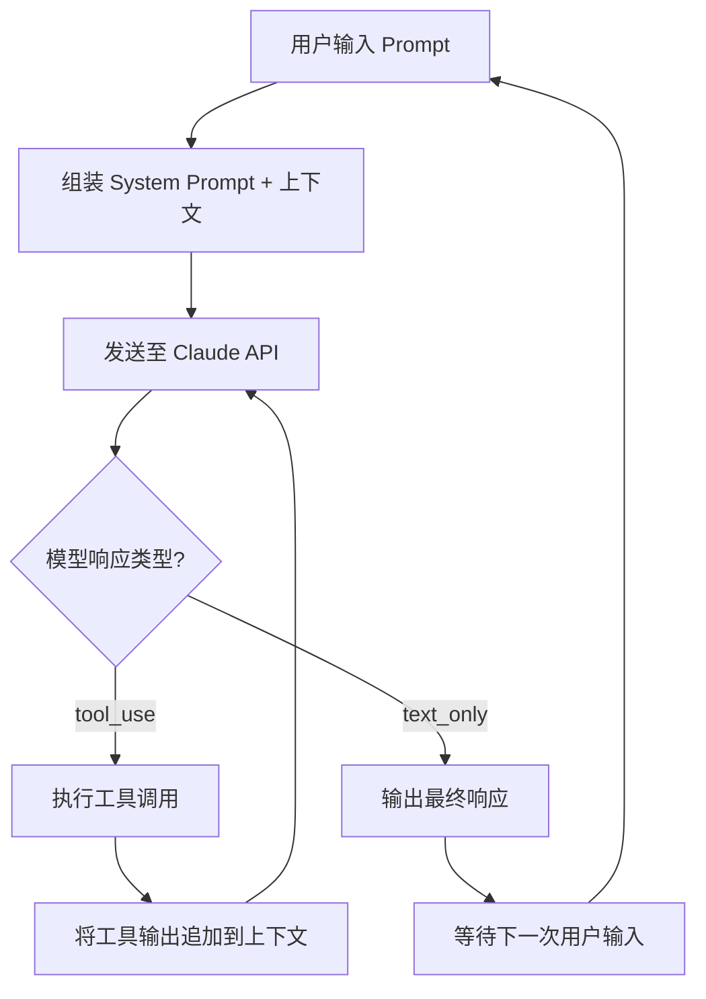
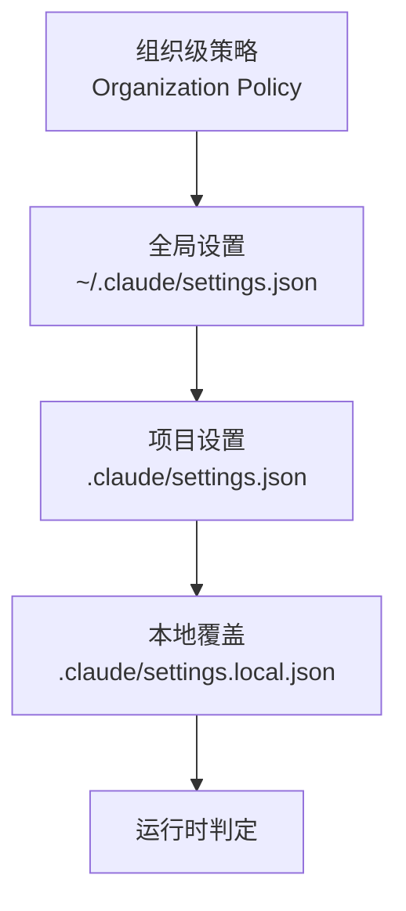
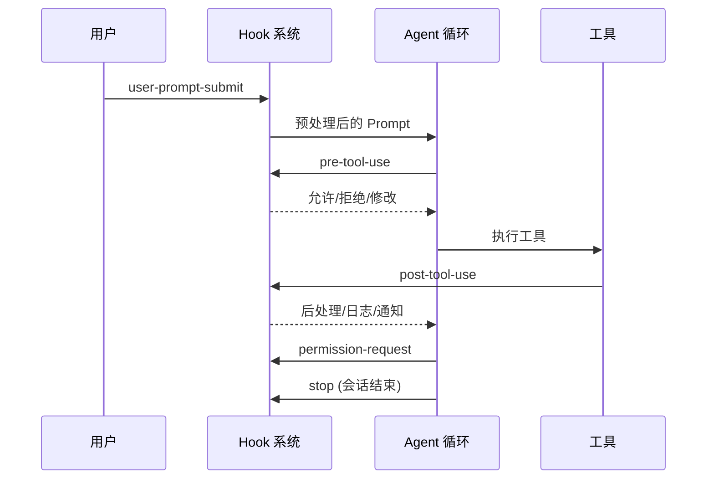
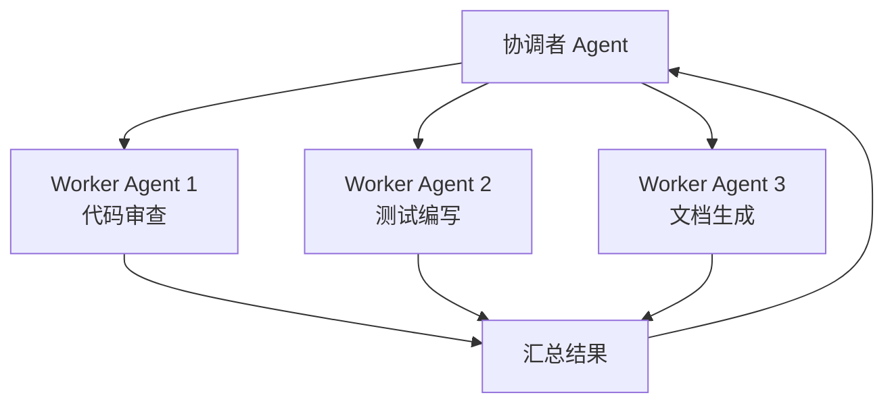
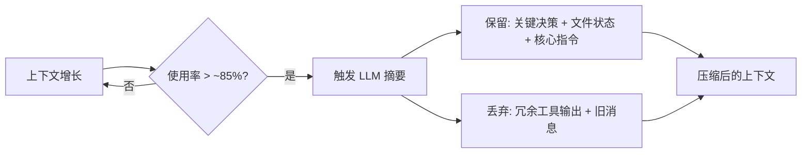
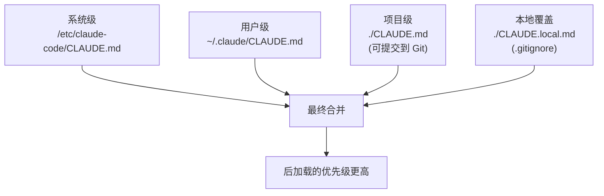
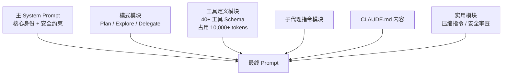
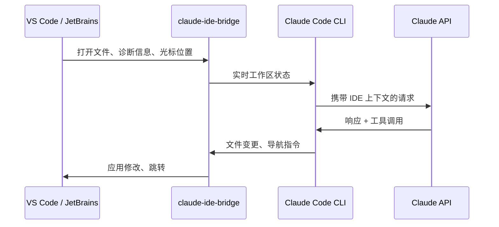
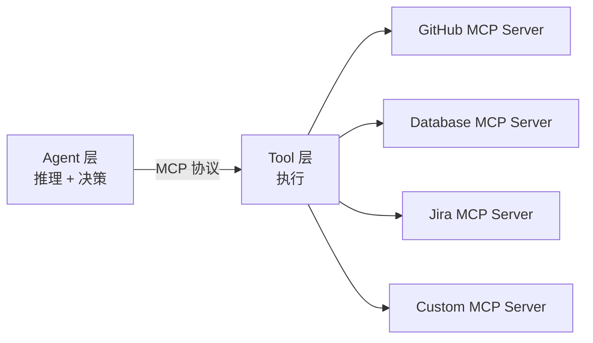

# Claude Code 架构深度解构报告

> **背景**：2026年3月31日，Anthropic 发布的 `@anthropic-ai/claude-code` npm 包中意外包含了 `.map` (source map) 文件。Source map 中的 `sourcesContent` 字段包含了完整的原始 TypeScript 源码，安全研究人员由此还原出约 **1,900 个文件、512,000+ 行代码**的完整项目。

---

## 1. 技术栈总览

| 层次 | 技术选型 | 选型理由 |
|------|---------|---------|
| **运行时** | [Bun](https://bun.sh/) | 极速启动、原生 TS 支持、内置打包器、高性能 I/O |
| **终端 UI** | [React](https://react.dev/) + [Ink](https://github.com/vadimdemedes/ink) | 声明式 UI、组件化管理复杂的流式输出和交互确认 |
| **布局引擎** | Yoga (Facebook) | 在终端中实现 Flexbox 布局 |
| **语言** | TypeScript | 类型安全、大型项目可维护性 |
| **包管理** | npm（发布通道） | 标准 Node.js 生态分发 |

> [!IMPORTANT]
> Claude Code 是一个**纯客户端 CLI 工具**，所有"智能"来自远程的 Claude 模型 API。泄露的仅是客户端编排代码，**不包含模型权重或后端基础设施**。

---

## 2. 核心架构：Agentic Loop（代理循环）

Claude Code 的核心是一个**极简的单线程 while 循环**，遵循 **Think → Act → Observe → Repeat (TAOR)** 模式：



### 关键设计要点

1. **终止条件**：循环仅在模型返回**纯文本响应**（不含 `tool_use`）时终止
2. **单线程顺序执行**：每次只执行一个工具调用，确保确定性
3. **上下文追加**：每次工具执行结果都追加到消息历史中，为下一轮推理提供依据
4. **无限循环保护**：内置最大迭代次数限制

> [!TIP]
> **对你的 Agent 架构的启示**：核心循环应尽量简单。复杂性应该下推到工具实现层和上下文管理层，而非循环本身。

---

## 3. 工具系统 (Tool System)

### 3.1 目录结构

```
src/tools/
├── BashTool.ts          # Shell 命令执行
├── FileReadTool.ts      # 文件读取
├── FileWriteTool.ts     # 文件写入
├── FileEditTool.ts      # 文件编辑（精确替换）
├── MultiEdit.ts         # 多处编辑
├── Grep.ts              # 文本搜索
├── Glob.ts              # 文件模式匹配
├── LS.ts                # 目录列表
├── WebFetchTool.ts      # 网页抓取
├── WebSearchTool.ts     # 网络搜索
├── MCPTool.ts           # MCP 协议桥接
├── SubAgentTool.ts      # 子代理调度
├── TodoTool.ts          # 任务管理
└── ...                  # 约 40+ 工具
```

### 3.2 工具实现模式

每个工具都是一个**自包含模块**，定义以下接口：

```typescript
// 推断的工具接口结构
interface Tool {
  name: string;                    // 工具名称
  description: string;             // 给模型看的描述
  inputSchema: JSONSchema;         // 输入参数的 JSON Schema
  permissionLevel: PermissionLevel; // 权限等级
  execute(input: ToolInput): Promise<ToolOutput>; // 执行逻辑
}
```

### 3.3 工具分类

| 分类 | 工具 | 说明 |
|------|------|------|
| **文件操作** | `FileReadTool`, `FileWriteTool`, `FileEditTool`, `MultiEdit` | 精确的文件 CRUD |
| **代码搜索** | `Grep`, `Glob`, `LS` | 代码库导航与搜索 |
| **系统执行** | `BashTool` | Shell 命令执行（最高风险） |
| **网络访问** | `WebFetchTool`, `WebSearchTool` | 外部信息获取 |
| **编排控制** | `SubAgentTool`, `TodoTool` | 多代理调度与任务管理 |
| **外部集成** | `MCPTool` | 通过 MCP 协议连接外部服务 |

> [!TIP]
> **架构启示**：每个工具应该是一个独立的、可插拔的模块。工具的 schema 定义既是给模型的"说明书"，也是输入验证的依据。

---

## 4. 权限与安全系统

### 4.1 分层权限模型



### 4.2 工具级权限控制

| 权限级别 | 行为 | 典型工具 |
|---------|------|---------|
| **自动批准** | 无需确认直接执行 | `Grep`, `Glob`, `LS`, `FileReadTool` |
| **需要确认** | 弹出确认提示 | `FileWriteTool`, `BashTool` |
| **受限执行** | 仅白名单命令可执行 | 特定 Bash 命令前缀 |
| **完全拒绝** | 无法执行 | 被组织策略禁用的工具 |

### 4.3 沙箱机制

- **Linux**: 使用 `bubblewrap` 容器化隔离
- **云端会话**: 隔离 VM
- **命令前缀验证**: Bash 命令需要通过前缀白名单检查

### 4.4 Hook 系统（生命周期钩子）

Hook 允许在 Agent 工作流的特定生命周期点注入**确定性逻辑**：



| Hook 类型 | 触发时机 | 典型用途 |
|-----------|---------|---------|
| `user-prompt-submit` | Prompt 发送前 | 输入预处理、安全审查 |
| `pre-tool-use` | 工具执行前 | 安全检查、拦截危险命令 |
| `post-tool-use` | 工具执行后 | 日志记录、格式化、通知 |
| `permission-request` | 需要权限时 | 自动批准策略 |
| `stop` | 会话结束时 | 清理、保存状态 |

> [!IMPORTANT]
> **架构启示**：Hook 系统是将 Agent 从"辅助工具"升级为"可靠自动化系统"的关键。它让开发者可以在不修改核心循环的前提下，注入验证、安全和编排逻辑。

---

## 5. 多 Agent 编排系统

### 5.1 子代理 (Sub-Agent)

核心 Agent 可以生成**专门化的子代理**，每个子代理拥有：
- 独立的上下文窗口（防止"上下文腐烂"）
- 特定的权限范围
- 专注的任务目标

子代理完成后仅向主会话返回**精炼的摘要**。

### 5.2 Coordinator Mode（协调者模式）

```
环境变量: CLAUDE_CODE_COORDINATOR_MODE=1
```

- 一个**主 Claude 实例**可以生成并管理**多个并行工作代理**
- 使用 **XML 格式**进行代理间通知和结果汇报
- 内部称为 **"Swarms"（蜂群）**



### 5.3 KAIROS（持久化助手模式）

内部代号的"持久化助手"，核心特性：
- **跨会话记忆**：通过每日日志持续积累项目知识
- **Dream 系统**：后台子代理在用户不活跃时"做梦"——分析、去重、合并记忆文件
- **始终在线**：设计为长期运行的有状态助手

### 5.4 ULTRAPLAN（远程深度规划）

- 将复杂规划任务发送到**远程 Claude 实例**
- 最长可运行 **30 分钟**
- 生成的计划方案通过**浏览器审批界面**呈现给用户
- 用户批准后结果**"传送"回本地终端**

### 5.5 其他模式

| 模式 | 说明 |
|------|------|
| **BUDDY** | 电子宠物式 AI 伴侣，18 种物种，含稀有度和个性属性（CHAOS, SNARK） |
| **Daemon Mode** | 后台会话监管 |
| **Bridge Mode** | 远程控制功能 |
| **UDS Inbox** | 通过 Unix Domain Socket 进行跨会话通信 |

---

## 6. 上下文窗口管理

### 6.1 自动压缩 (Auto-Compaction)



### 6.2 手动压缩

```
/compact [可选的聚焦指令]
# 例如: /compact 专注于 API 变更部分
```

### 6.3 上下文策略优先级

1. **CLAUDE.md** → 持久化上下文（每次会话开始加载）
2. **子代理隔离** → 深度任务使用独立上下文窗口
3. **工具输出裁剪** → 大量输出自动截断
4. **渐进式加载** → 工具定义和知识按需加载

> [!TIP]
> **架构启示**：上下文管理是 Agent 工程中最被低估的部分。CLAUDE.md 作为"持久记忆层"的设计范式值得借鉴——将关键规则存储在文件中，而非依赖对话历史。压缩策略（保留决策、丢弃过程）也是关键。

---

## 7. 持久记忆系统 (CLAUDE.md 层级)



### Auto-Memory（自动记忆）

- Agent 自动**观察用户的工作模式**、编码风格、项目习惯
- 自动保存为记忆笔记，避免用户重复说明

### Auto-Dream（自动做梦）

- "Memory 2.0" — 后台子代理定期执行
- **分析**现有记忆文件 → **去重和合并**冗余指令 → **清理**上下文窗口
- 确保项目增长时记忆系统保持高效

---

## 8. System Prompt 架构

Claude Code **不使用单一静态 System Prompt**，而是采用**动态模块化组装**：



### Prompt 结构要素

| 模块 | 内容 | 作用 |
|------|------|------|
| **身份定义** | "你是一个高级软件工程师" | 设定角色和行为基调 |
| **安全约束** | 权限边界、命令白名单 | 设定"围墙" |
| **质量标准** | 代码质量定义、完成标准 | 定义"好"的标准 |
| **策略指南** | "先规划"、"验证变更" | 提供灵活指导而非刚性步骤 |
| **工具使用策略** | 多工具可选时的优先级 | 引导工具选择偏好 |

### "Undercover Mode"（潜伏模式）

源码中的 `utils/undercover.ts` 实现：
- 检测当前是否在公开/开源仓库中工作
- 如果是，**阻止 AI 泄露 Anthropic 内部信息**（代号、内部 API 等）
- 防止敏感信息出现在 git commit 或日志中

---

## 9. IDE Bridge 系统



- 连接终端 Agent 与图形 IDE
- 提供：打开的文件列表、诊断数据、调用层次、测试输出
- 支持 Local 和 Remote-SSH 场景

---

## 10. MCP (Model Context Protocol) 集成



- MCP 服务器向 Agent **描述自身能力**（工具、Schema、端点）
- Agent **发现并调用**这些能力
- 实现了 Agent 层与 Tool 层的**解耦**

---

## 11. 内部发现：特性标志与代号

### 模型代号

| 代号 | 含义 |
|------|------|
| **Tengu** | Claude Code 项目本身的内部代号 |
| **Capybara** | "Claude Mythos" 模型层级的代号 |
| **Fennec** | Opus 系列的内部代号 |

### 内部版本引用

源码中出现了未发布的版本字符串：`opus-4-7`, `sonnet-4-8`

### 遥测系统

- 监控用户**挫败感**（检测用户是否在"骂人"）
- 追踪用户输入 `"continue"` 的频率（衡量 Agent 是否过早停止）
- `CACHED_MAY_BE_STALE()` 函数命名反映**延迟优先于数据新鲜度**的工程哲学

---

## 12. 可复用的 Agent 架构设计模式

> [!IMPORTANT]
> 以下是从 Claude Code 架构中提取的、可直接应用于你自己的 Agent 架构的设计模式。

### 模式 1: 极简核心循环 + 丰富工具生态

```
while (true) {
    response = model.generate(context)
    if (response.hasToolCall) {
        result = executeTool(response.toolCall)
        context.append(result)
    } else {
        return response.text  // 终止
    }
}
```

**要点**：核心循环保持极简（<50 行代码），复杂性全部推入工具层。

### 模式 2: 自包含工具模块

每个工具定义三件事：
1. **Schema**（输入/输出的 JSON Schema）—— 既是模型的说明书，也是验证器
2. **Execute**（执行逻辑）—— 纯函数，无副作用依赖
3. **Permission**（权限声明）—— 工具自声明危险等级

### 模式 3: 分层配置

```
系统默认 < 全局用户配置 < 项目配置 < 本地覆盖 < 运行时参数
```

每层可以覆盖上一层，最终合并为一份有效配置。

### 模式 4: Hook 生命周期

在工作流关键节点暴露 Hook 点（`pre-*`, `post-*`），允许外部注入逻辑，而不修改核心代码。

### 模式 5: 持久化文件记忆

用文件系统（而非数据库）存储长期记忆：
- 易于版本控制（Git）
- 人类可读可编辑
- 天然支持"项目共享"（提交到 repo）vs "个人私有"（.gitignore）

### 模式 6: 子代理隔离

- 独立上下文窗口
- 窄化的权限范围
- 仅返回精炼摘要
- 防止主会话上下文膨胀

### 模式 7: 动态 Prompt 组装

根据当前会话状态、启用的工具、活跃模式，**动态拼装** System Prompt，而非使用一个巨大的静态 Prompt。

### 模式 8: 上下文压缩策略

- 保留：**决策**、**文件状态**、**核心规则**
- 丢弃：**过程性工具输出**、**旧消息**
- 触发时机：上下文使用率 > 85%

---

## 13. 为你的 Agent 架构建议的技术选型

基于 Claude Code 的验证，以下是适合你（已有 Vue 3 + Vite + Node.js 技术栈）的建议：

| 层次 | Claude Code 方案 | 你的可选方案 | 建议 |
|------|------------------|-------------|------|
| 运行时 | Bun | Node.js / Bun | 若追求性能选 Bun，求稳选 Node.js |
| UI | React Ink (终端) | Vue 3 (Web) / Ink (CLI) | 取决于你的 Agent 是 Web 还是 CLI |
| Agent 核心 | 自研 while 循环 | LangChain / 自研 | 建议自研，可控性更强 |
| 工具协议 | 自定义 + MCP | MCP 标准 | 强烈建议采用 MCP，生态丰富 |
| 记忆系统 | 文件系统 (CLAUDE.md) | 文件系统 + SQLite | 文件做持久记忆，SQLite 做结构化数据 |
| 权限系统 | 分层配置 + Hooks | 你的 RBAC 系统 + Hooks | 可复用 Nautilus 已有的 RBAC |

---

## 14. 参考资源

- npm 包: `@anthropic-ai/claude-code`（source map 已在后续版本移除）
- GitHub 上已有多个还原仓库（搜索 "claude-code source leak"）
- Anthropic 官方文档: [docs.anthropic.com/en/docs/claude-code](https://docs.anthropic.com/en/docs/claude-code)
- MCP 协议规范: [modelcontextprotocol.io](https://modelcontextprotocol.io)

> [!WARNING]
> 泄露的源码属于 Anthropic 的知识产权。引用架构模式用于学习和设计参考是合理的，但直接复制代码需注意法律风险。
